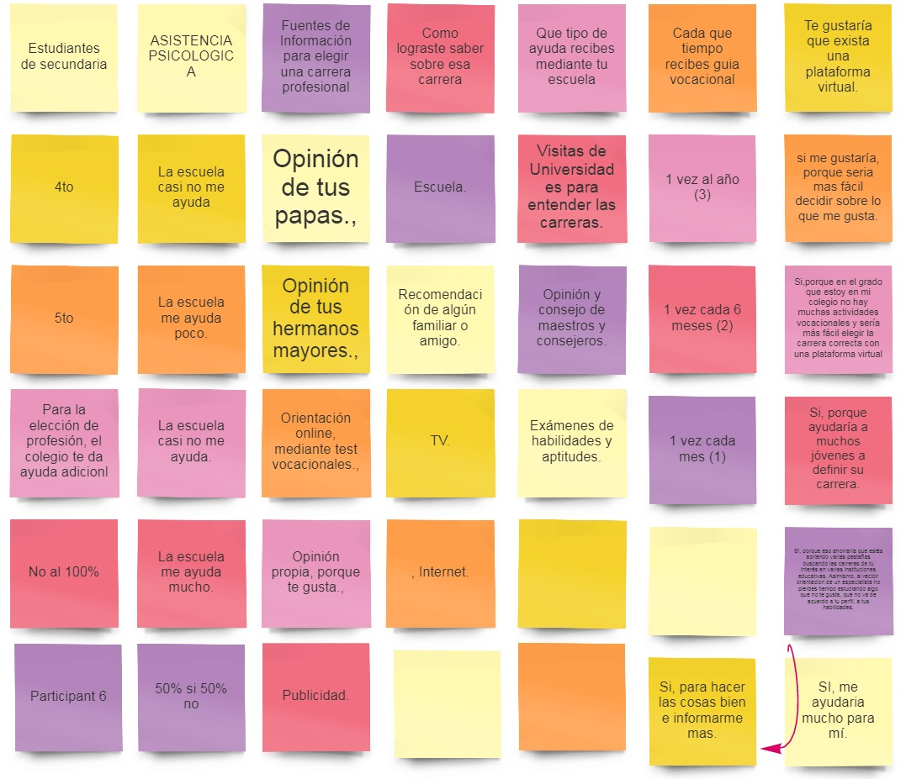
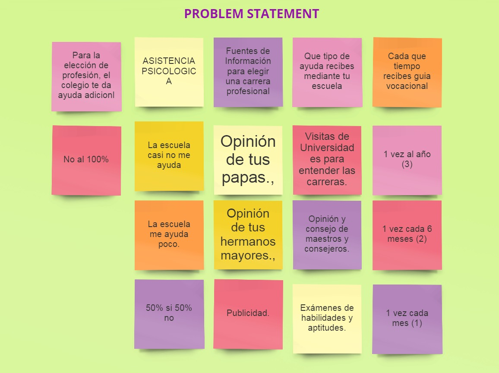

# Retos de codigo

*** Crear una herramienta que sirva de guía al momento de escoger una carrera profesional, dirigida a alumnos de 4to y 5to año de educación secundaria.

***

## Design thinking.

### Descubrimiento e Investigación (Emphatizar).
### Proceso de Negocios.
### Planeamiento

Presentación de Kick Off y conversaciones en el equipo para poder analizar cuáles serían las metodologías a usar para el reto asignado.

### DESCUBRIMIENTO

#### MODELO CANVAS.

 

 
### EXPLORACION.
### TESTEO.
### ESCUCHAR.

