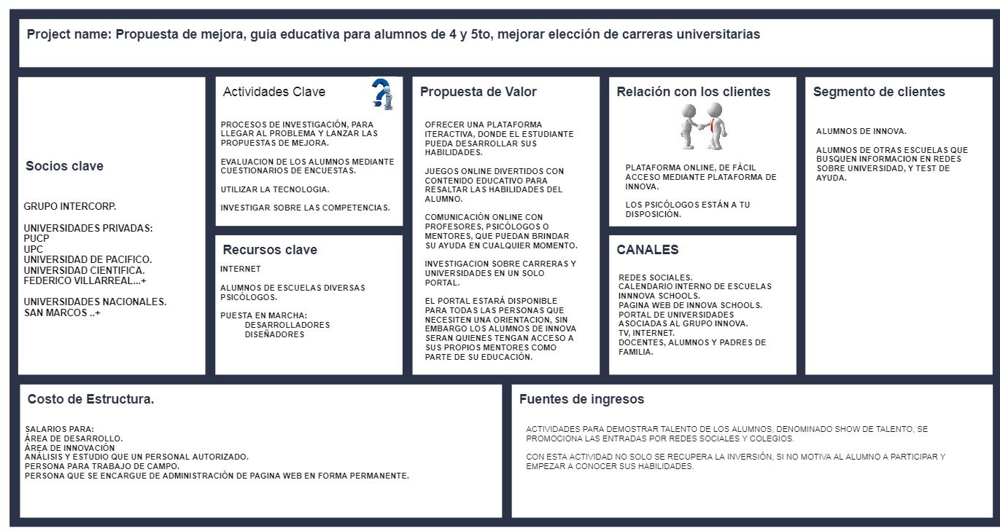
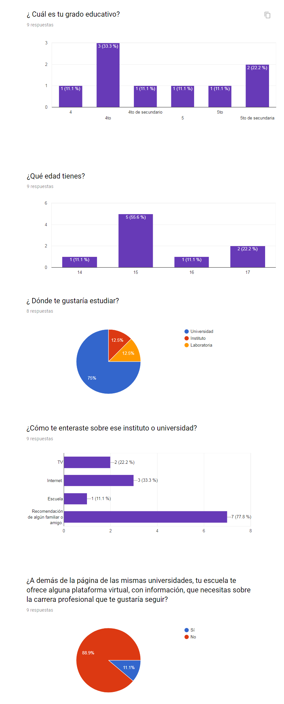
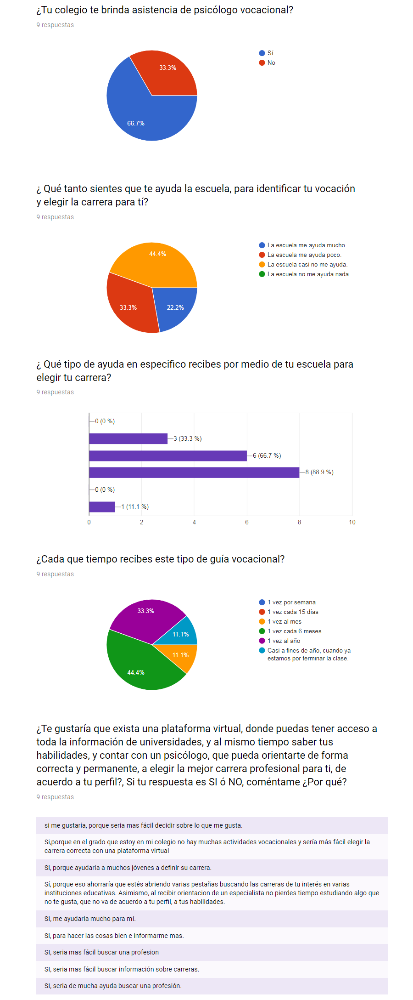
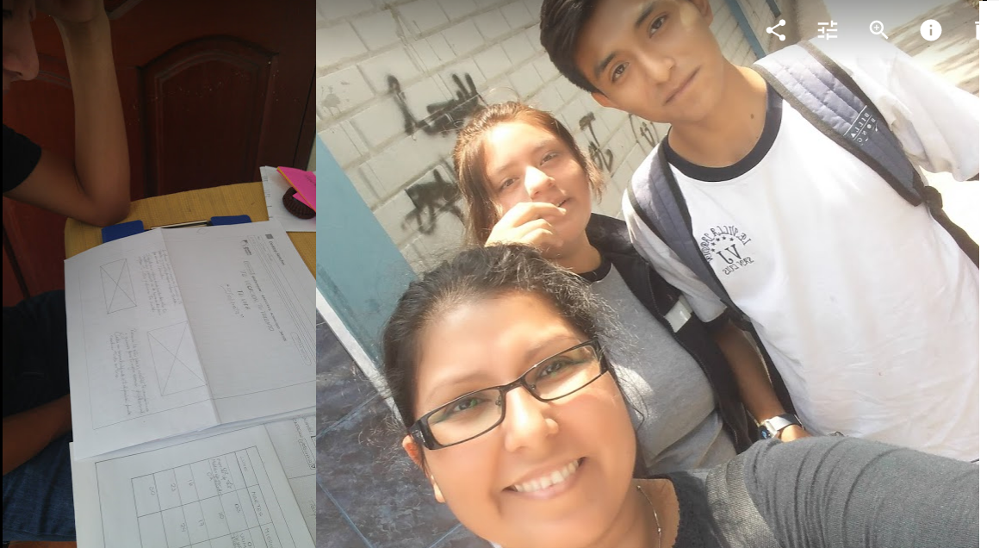
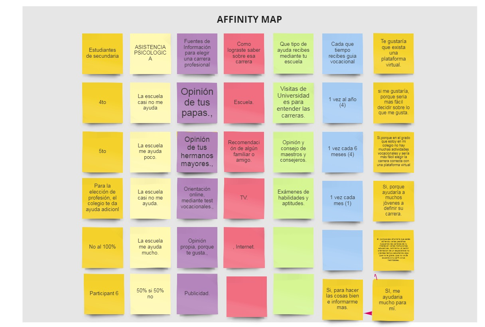
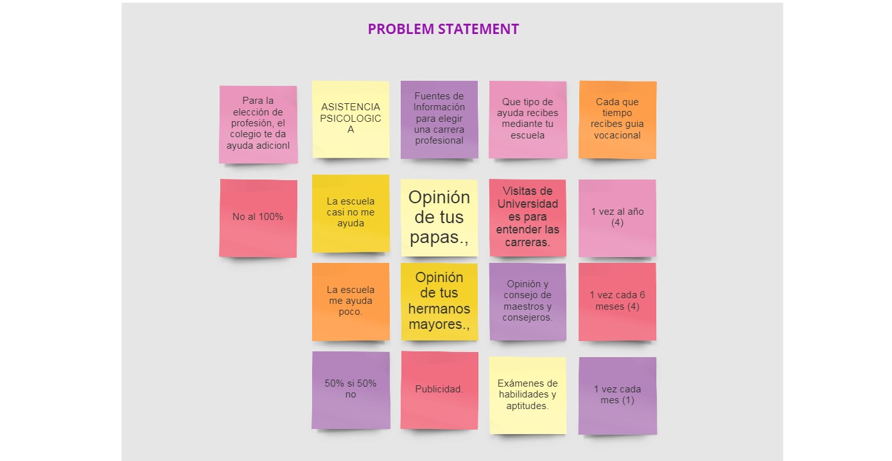
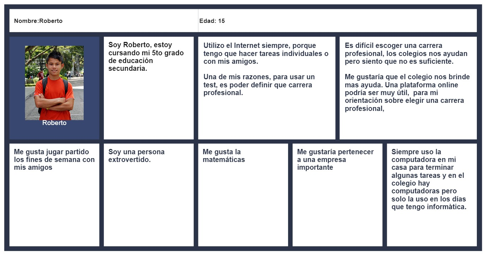
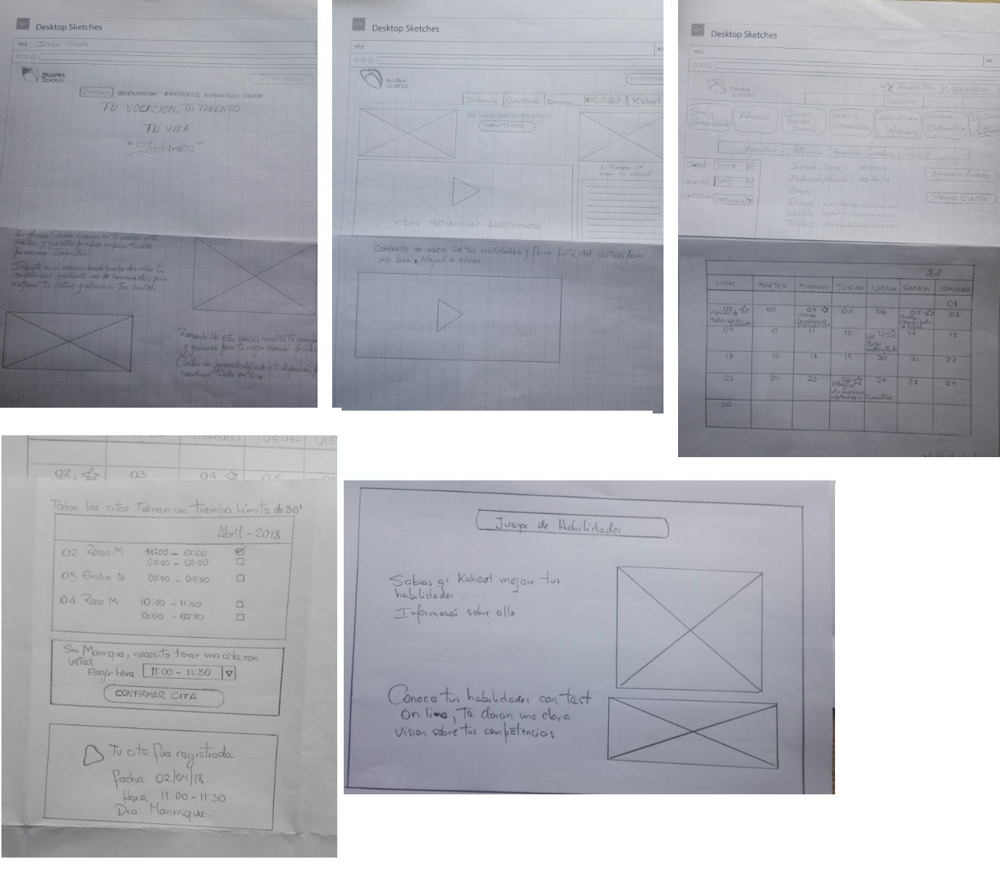
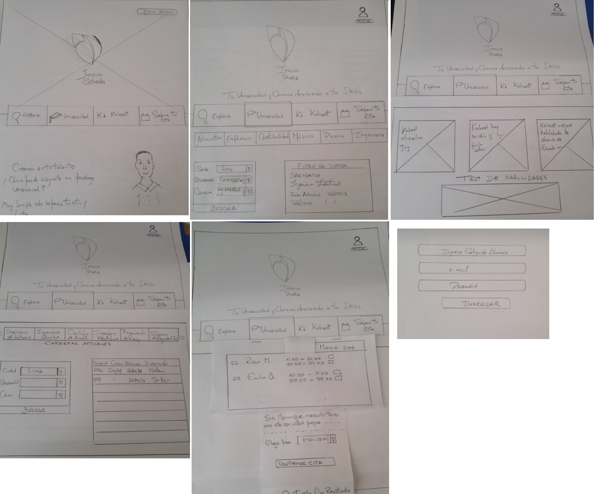
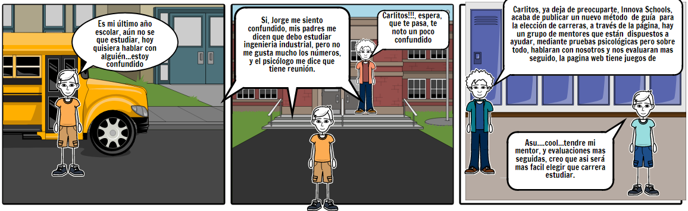

# Retos de codigo

*** Crear una herramienta que sirva de guía al momento de escoger una carrera profesional, dirigida a alumnos de 4to y 5to año de educación secundaria.

***

## Design thinking.

### Descubrimiento e Investigación (Emphatizar).
### Proceso de Negocios.
### Planeamiento

Presentación de Kick Off y conversaciones en el equipo para poder analizar cuáles serían las metodologías a usar para el reto asignado.

### STAKHOLDERS
- Gerente General.
- Equipo directivo.
- Consejo Escolar.
- Coordinadores.
- Departamento de Innovación, creatividad o desarrollo.
- Departamento de Diseño.
- Departamento de finanzas.
- Principal-Usuarios.
- 

### DESCUBRIMIENTO

#### MODELO CANVAS.
 

#### ENCUESTAS.
NUMERO           | PREGUNTAS
-----------------|----------------------------------------------------------------------------------------
    1            | ¿ Cuál es tu grado educativo?
    2            | ¿Qué edad tienes?
    3            | ¿ Dónde te gustaría estudiar?
    4            | ¿Qué carrera profesional quieres estudiar?
    5            | ¿Cuál de los siguientes consejeros o fuentes de información estas consultando, para elegir tu carrera?
    6            | ¿Cómo se llama la universidad o Instituto donde quieres estudiar?
    7            | ¿Cómo te enteraste sobre ese instituto o universidad?
    8            | ¿A demás de la página de las mismas universidades, tu escuela te ofrece alguna plataforma virtual, con información, que necesitas sobre la carrera profesional que te gustaría seguir?
    9            | ¿Tu colegio te brinda asistencia de psicólogo vocacional?
    10           | ¿ Qué tanto sientes que te ayuda la escuela, para identificar tu vocación y elegir la carrera para tí?
    11           | ¿ Qué tipo de ayuda en especifico recibes por medio de tu escuela para elegir tu carrera?
    12           | ¿Cada que tiempo recibes este tipo de guía vocacional?
    13           | "¿Te gustaría que exista una plataforma virtual, donde puedas tener acceso a toda la información de universidades, y al mismo tiempo saber tus habilidades, y contar con un psicólogo, que pueda orientarte de forma correcta y permanente, a elegir la mejor carrera profesional para ti, de acuerdo a tu perfil?, Si tu respuesta es SI ó NO, coméntame ¿Por qué?
  

 
 
 

#### MODELO AFFINITY MAP.
 

#### MODELO PROBLEM STATEMENT.
 

#### USER PERSONA
 

### IDEACION
### 1ER PROTOTIPO.
 

### 2DO PROTOTIPO.
 

### Storytelling
 

### TESTEO.
- Se realizaron dos prototipos, según los comentarios de los usuarios el 2do prototipo es el que es mas entendible e intuitivo, los iconos grandes, hacen que te jale la vista.

### ESCUCHAR.

